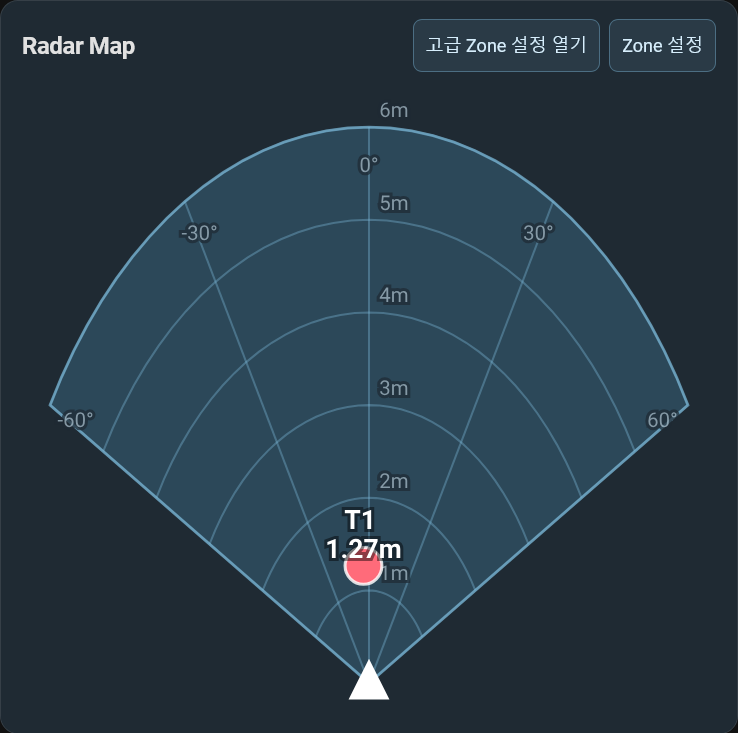
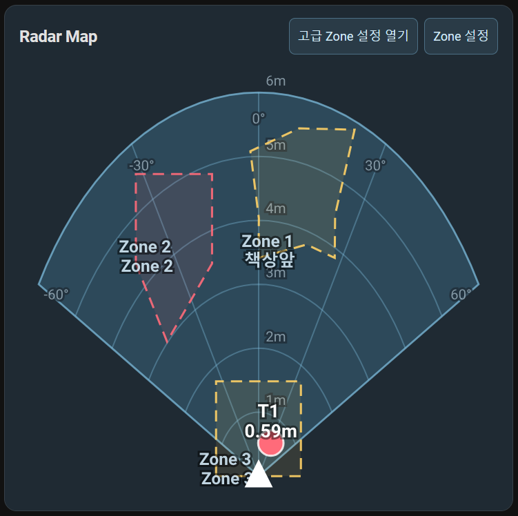
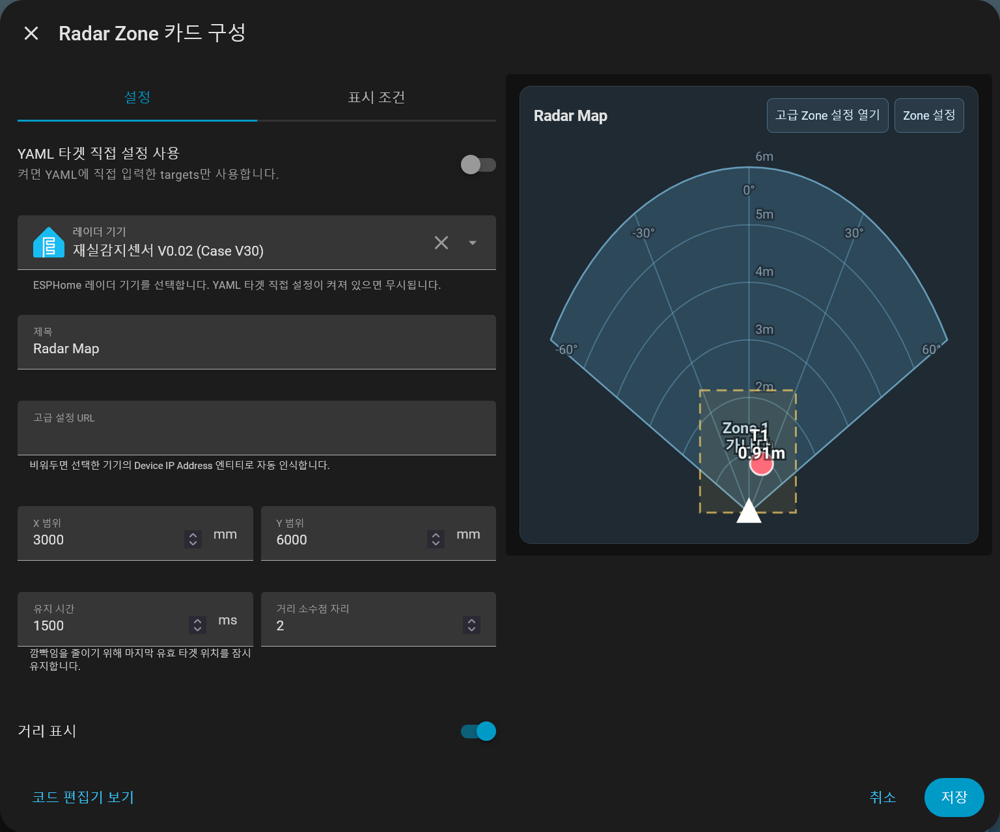
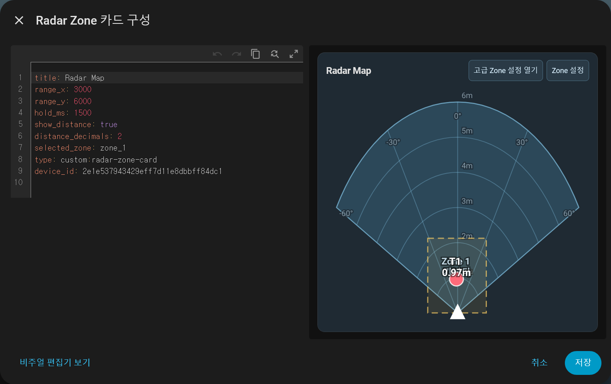

# Radar Zone Card

LD2450 mmWave 레이더 센서의 타겟 위치와 Zone 설정을 Home Assistant 대시보드에서 시각화하기 위한 커스텀 카드입니다.

현재 이 프로젝트는 ESPHome 기반 LD2450 재실 감지 센서와 함께 사용하는 것을 기준으로 개발 중입니다.

## 주요 기능



기본적으로 지원되는 기능은 아래와 같습니다.
- LD2450 타겟 위치 실시간 표시
- 타겟별 거리 표시
- 사각형 Zone 표시
- Detection / Filter / Disabled Zone 타입 표시
- Home Assistant 비주얼 에디터 지원

특정 펌웨어와만 호환되는 기능은 아래와 같습니다.
- 다각형 Software Zone 표시
- 오탐 보정 Zone 표시
- Software Zone JSON 연동
- 고급 Zone 설정 웹앱으로 이동하는 버튼

## 현재 상태

Preview 버전입니다.

기본적인 레이더맵 표시와 Zone 시각화는 동작하지만, 모든 LD2450 DIY 구성에서 바로 동작하도록 범용화된 상태는 아닙니다.

## 설치 방법

### 0. 커스텀 카드 파일 다운로드
[Release 에서 다운로드하기](https://github.com/David2766/radar-zone-card-for-LD2450/releases/tag/v0.1.0-alpha)

### 1. 카드 파일 복사

빌드된 파일을 Home Assistant의 `www` 폴더에 복사합니다.

```text
dist/radar-zone-card.js
```

예시:

```text
/config/www/radar-zone-card.js
```

### 2. Lovelace 리소스 등록

Home Assistant에서 다음 리소스를 추가합니다.

```yaml
url: /local/radar-zone-card.js
type: module
```

### 3. 대시보드 카드 추가

기본 예시는 다음과 같습니다.

```yaml
type: custom:radar-zone-card
title: Radar Map
```
비주얼 에디터에서 기기를 선택하면 지원되는 엔티티를 자동으로 찾도록 설계되어 있습니다.



## 수동 설정 예시

자동 인식이 되지 않는 경우, 타겟 X/Y 엔티티를 직접 지정할 수 있습니다.



```yaml
type: custom:radar-zone-card
title: Radar Map
range_x: 3000
range_y: 6000
hold_ms: 1500
show_distance: true
distance_decimals: 2
use_yaml_targets: true
targets:
  - name: T1
    color: "#ff6b7a"
    x: sensor.your_device_target_1_x
    y: sensor.your_device_target_1_y
  - name: T2
    color: "#ffd166"
    x: sensor.your_device_target_2_x
    y: sensor.your_device_target_2_y
  - name: T3
    color: "#06d6a0"
    x: sensor.your_device_target_3_x
    y: sensor.your_device_target_3_y
```

## 지원 범위

현재 기본적으로 다음 구조를 기대합니다.

- LD2450 타겟 X/Y 엔티티
- 최대 3개 타겟
- ESPHome 기반 센서
- 선택 사항:
  - Software Zone JSON 엔티티
  - 고급 Zone 설정 URL 엔티티
  - 오탐 보정 Zone 정보

## 제한 사항

- 모든 LD2450 펌웨어와 자동 호환되는 범용 카드는 아직 아닙니다.
- Software Zone 및 오탐 보정 기능은 별도 펌웨어 지원이 필요합니다.
- 고급 다각형 Zone 편집은 카드 내부가 아니라 별도 웹앱과 연동하는 구조입니다.
- 현재는 Preview 단계이므로 설정 구조가 변경될 수 있습니다.

## 개발

의존성 설치:

```bash
npm install
```

Home Assistant 카드 빌드:

```bash
npm run build:ha
```

웹앱 빌드:

```bash
npm run build:web
```

타입 체크:

```bash
npm run typecheck
```

## 라이선스

AGPL-3.0

## 기타

이 프로젝트는 제작자가 직접 기획하고 테스트하면서, 코드 작성과 리팩토링 과정에 OpenAI Codex를 활용해 개발했습니다.

